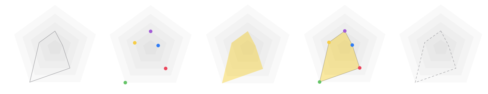
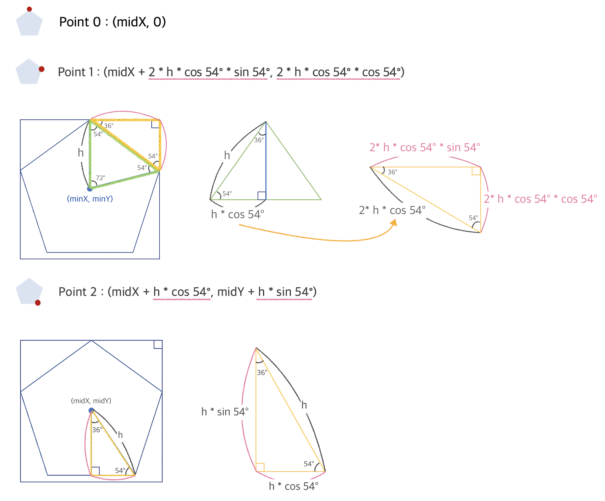
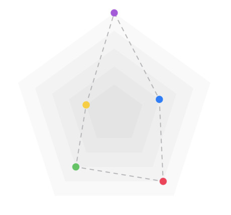
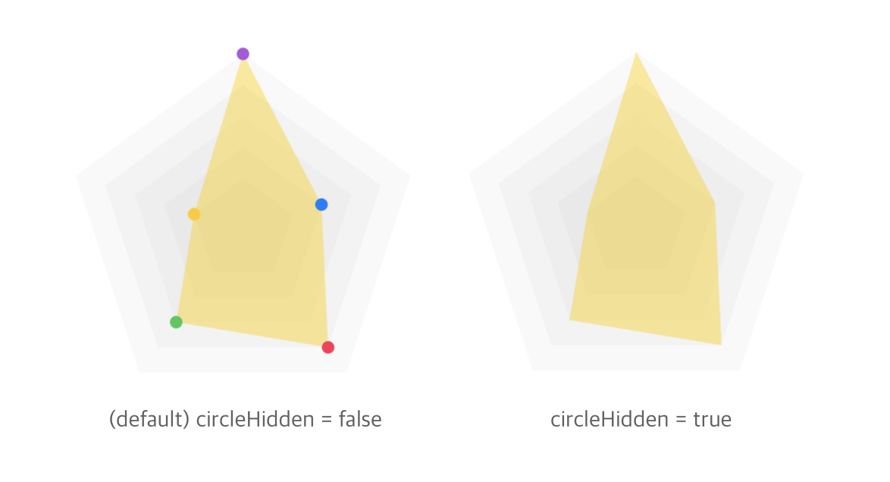

# HBRadarChart

[](https://travis-ci.org/kimhyebeen/HBRadarChart)
[](https://cocoapods.org/pods/HBRadarChart)
[](https://cocoapods.org/pods/HBRadarChart)
[](https://cocoapods.org/pods/HBRadarChart)

HBRadarChart provides radar charts with polygonal shapes such as pentagon. This helps to show 5 data in radar chart. It can be represented by lines only, or by colored polygons.

<br />

HBRadarChart는 다각형 그래프 차트 라이브러리입니다. IT연합동아리 [DND](https://dnd.ac/) 4기 활동을 할 때, 디자인된 화면에 데이터 통계를 보여주기 위한 오각형 차트가 있어서 라이브러리로 만들어도 괜찮다고 생각해서 구현하게 되었습니다. 현재 오각형 차트만 있지만, 앞으로 여유가 생길 때마다 다른 다각형 차트도 추가해볼 예정입니다 :)

## Example

To run the example project, clone the repo, and run `pod install` from the Example directory first.



## Requirements

iOS '13.0'

## Installation

HBRadarChart is available through [CocoaPods](https://cocoapods.org). To install
it, simply add the following line to your Podfile:

```ruby
pod 'HBRadarChart'
```
```ruby
pod 'HBRadarChart', :git => 'https://github.com/kimhyebeen/HBRadarChart'
```

## Basics

I used the principle below. Since `HBPentagonChart` makes 5 pentagons layered, it was implemented in consideration of the difference in position and size of each pentagon in the following principle. Since the Y values of **Point 3** and **Point 2** are the same, and the Y values of **Point 4** and **Point 1** are the same, the positions of **Point 3** and **Point 4** can also be obtained by changing `midX + (something)` to `midX - (something)` in the x values.

 



## Usage
* import this module.
````swift
import HBRadarGraph
````

<br />

* create a property for PentagonGraph in your ViewController
````swift
let pentagonGraph = HBPentagonGraph(frame: CGRect(x: self.view.frame.midX - 110, y: self.view.frame.midY - 110, width: 220, height: 220))
````

<br />

* setting the values in your `HBPentagonGraph`.

`graphValues` means the graph value of each data. 0 is the largest value and 4 is the smallest value in the graph value. The graph value must be an integer value.



````swift
pentagonGraph.graphValues = [0,3,1,2,4]
pentagonGraph.backgroundColor = .clear
self.view.addSubview(pentagonGraph)
````

<br />

* you can change the design of graph like this.



````swift
pentagonGraph.graphValues = [0,3,1,2,4]
pentagonGraph.circleHidden = true // or false
pentagonGraph.isStrokeGraph = false
pentagonGraph.isFillGraph = true
pentagonGraph.backgroundColor = .clear
self.view.addSubview(pentagonGraph)
````

 <br />

## Properties
* pentagonColor: UIColor
    + color of base pentagons under the graph
* pentagonMaxSize: CGFloat
    + max size of HBPentagonRadarChart
* pentagonSpacing: CGFloat
    + space size between each base pentagon
* graphStrokeColor: UIColor
    + stroke color of chart
* graphFillColor: UIColor
    + filled color of chart
* graphValues: [Int]
    + values of chart
    + the number of values must be 5.
    + basic value is [4,4,4,4,4]
* graphLineWidth: CGFloat
    + line width of chart
* isDottedLine: Bool
    + If isDottedLine is true, the chart line is dotted.
* isStrokeGraph: Bool
    + If isStrokeGraph is true, the chart line is not hidden.
* isFillGraph: Bool
    + If isFillGraph is true, the chart color is not transparent.
* contentsColors: [UIColor]
    + the color of each point
    + the number of values must be 5.
    + basic value is [.systemPurple, .systemBlue, .systemPink, .systemGreen, .systemYellow]
* circleSize: CGFloat
    + size of points
    + basic value is 4.
* circleHidden: Bool
    + If circleHidden is true, points are hidden.

<br />

## Author

kimhyebeen, kimhbin@naver.com

## License

HBRadarChart is available under the MIT license. See the [LICENSE file](./LICENSE) for more info.
